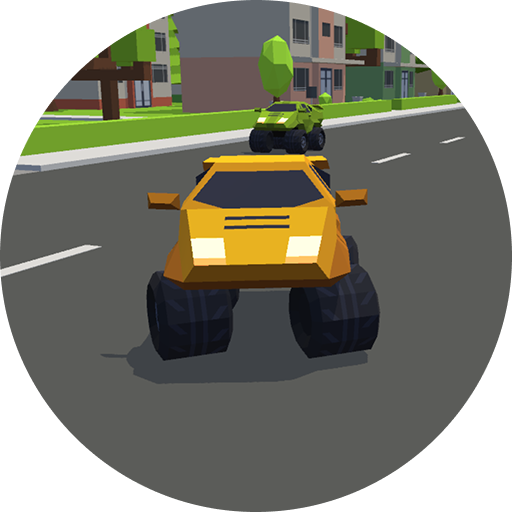
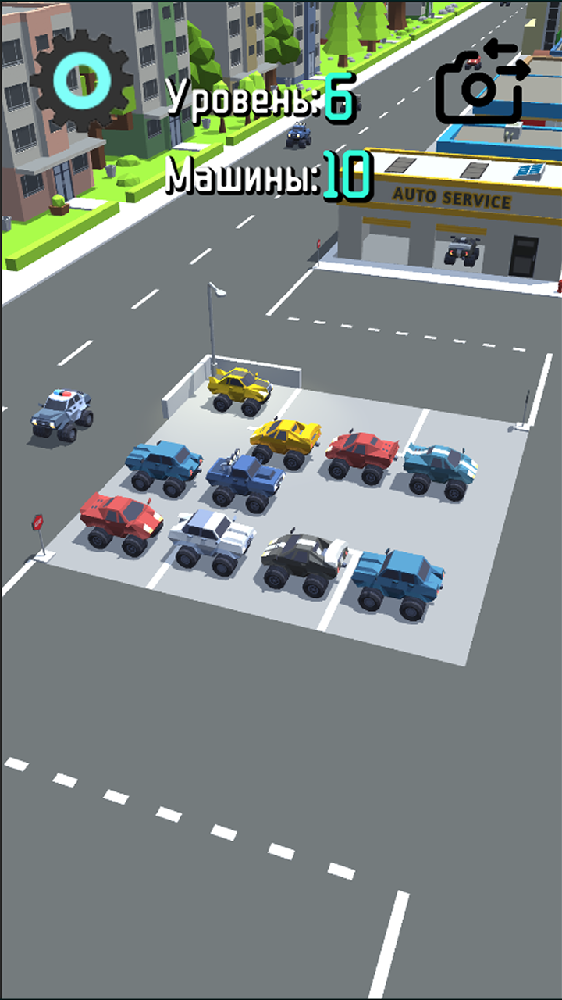
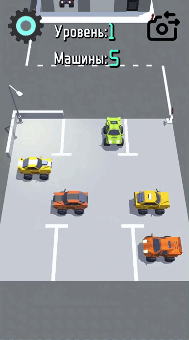
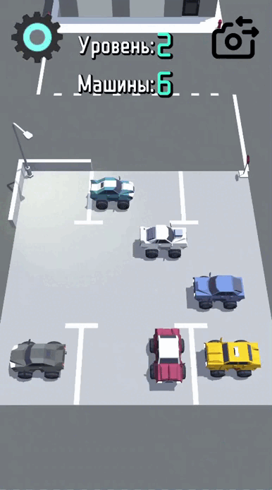

# ChaosParking

  <!-- Верхняя часть - картинка -->
  

    
  

  <!-- Нижняя часть - текст -->
  

    <h2 style="color: #2d2d2d; margin-bottom: 10px;">ChaosParking</h2>
    

      Захватывающая головоломка с большим числом уровней и нарастающей сложностью! Попытайся вывести все машины с парковки без происшествий!
    

  

## Гемплей
Освободите парковку и отправляйте машины в нужную сторону, избегая столкновений с бордюром и другими автомобилями.

    

Проходите уровни!

Не делайте так!!!

 

<h2>FAQ</h2>

<h3>Игровой процесс</h3>
Свайпайте по машинам в сторону, в которую хотите, чтобы она ехала. 
Недопускайте столкновений с препятствиями на территории парковки.
Будте внимательны! Не направляйте машины друг на друга. 

<h3>Сохранение</h3>
Все пройденные уровни сохраняются и автоматически загружаются при повторном заходе!

## Установка
1. Склонируйте репозиторий по ссылке:
https://github.com/konopaty11/ChaosParking.git
2. Откройте проект в Unity 2022.3.60f1 или выше
3. Откройте сцену: Scenes/MainScene

